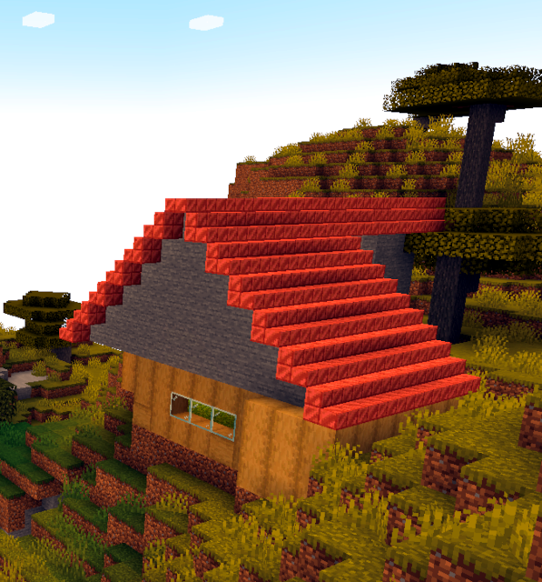

# Learning Docker and Networking With Minecraft

Containerization is a pretty powerful (and relatively recent) tool, and despite considerable licensing changes, Docker is still the default "way to go". But the logic behind Docker images, spinning them up, and integrating/exposing them to provide something like a usable service (or services) isn't always obvious. So, let's learn Docker and networking principles to start our own Minecraft server!

# Spin Up A Minecraft Server

The first thing you need, of course, is an image. Very few containers are defined from scratch. Typically, you need a little research to find out a good "starting point" from which you can build our your service--and Docker's "Hub" service is a great place to start, whether you're starting from a Linux distribution or from a fully-architectured, tool-specific server image already.

So, let's browse to Docker Hub and see what kind of Minecraft server options exist:

  [https://hub.docker.com/search?q=minecraft&type=image](https://hub.docker.com/search?q=minecraft&type=image)

You typically want to find a service that is well-used, regulary-updated, and reasonably well-liked (e.g., Stars). In this case, the obvious choice is <itzg/minecraft-server>--and if you look at the image listing page, you'll see it's super-easy to get started:

  [https://hub.docker.com/r/itzg/minecraft-server](https://hub.docker.com/r/itzg/minecraft-server)

Now you know what your "base image" is, you can create a Dockerfile that defines your specific extension of this image will be. This will make it easy to add specific configuration options, etc. Your first Dockerfile line will just reference this "upstream" image:

`FROM itzg/minecraft-server`

Now you can do a basic build-and-run pair of Docker commands:

```
docker build -t dockercraft:latest .
docker run -p=25565:25565 dockercraft:latest
```

And that's it! You now have a fully-functional Minecraft server, running on your computer. You can even connect to it from a local Minecraft client (e.g., running on the same computer), if you want to test it.

## Configure Your Minecraft World

But this Minecraft world is a little bit boring. We want to control it, define it, configure it, customize it! And the easiest way to do this with *any* Docker container is from an .ENV configuration. Create a "config.env" file, and add some Minecraft server configuration options as environmental variable values:

```
EULA=TRUE
SERVER_NAME=DockerCraft
MODE=creative
DIFFICULTY=peaceful
LEVEL_SEED=suberuber
```

You can look at the "minecraft bedrock server" documentation to see how specific environment variables map to server configuration options:

  [https://hub.docker.com/r/itzg/minecraft-bedrock-server](https://hub.docker.com/r/itzg/minecraft-bedrock-server)

Why are we defining this in an .ENV file? This is a "best practice" because:

* Configuration is defined external to the container, so we don't need to rebuild it when we want to adjust the configuration

* We can easily "swap out" different .ENV files for different deployment configurations--even storing or sharing specific .ENV resources as configurations evolve

* Settings defined from environmental variables are stateless (e.g., not stored in a filesystem within the container), meaning they can be forwarded from any runtime or orchestratinon solution. There are well-defined mechanisms for forwarding environmental variable configuration values from Docker Compose, Kubernetes, and pretty much every other orchestration solution.

Once you've defined your "config.env" file, you can re-run your Docker container using that configuration using the "--env-file" flag:

`docker run -p=25565:25565 --env-file=config.env dockercraft:latest`

If you watch the startup messages, you can see specific values (like the game mode) being extracted, recognized, and applied while the server initializes. Feel free to customize this configuration and make it your own!

## Open Up Your Firewall

But, we want other people to be able to connect to our server, too! This means we need to think about networking. And the first step in defining a network route is adding a rule to your system's firewall. This rule will tell your computer that it's okay to accept incoming connections on the port where our Minecraft server will be listening.

We'll use the Windows Defender Firewall here for reference. If you are using a different security product, but still on Windows, you should still be able to follow along--most other security products will "inherit" or reuse the firewall settings Windows manages.

* Open up your Start menu and search for "Windows Defender Firewall".

* You should see an option on the right-hand side of the resulting window that says "Advanced Settings"; click on it

* You should now see the "old school" firewall configuration window, with an item on the left that says (among others) "Inbound Rules"; click on it

* You should now see "Actions" listed on the right-hand side; from this list, select "New Rule..."

* The new rule should use protocol type "TCP", and apply to a specific port (25565)

Once created, you now have a firewall rule for incoming connections on port 25565! If this was painful--don't worry. You only have to do it once.

## Forward Your Router Port

If you are configuring this for your own computer (as opposed to a network at work, for example), you are likely sitting behind a router--perhaps a wireless network adapter plugged into your internet service provider. This is pretty straightforward, but you do need to know your router's administrative URL and credentials. Hopefully, these are documented by your router provider.

* If you open your router's administrative URL, you should see a list of devices or device configurations.

* If you select your device, or security settings, you should see something like an "advanced" section that includes "port forwarding" rules.

* Add a new rule for port forwarding; it should be a single-port forwarding rule for port 25565, ideally for both UDP and TCP.

* You may also need to define (if the rule is not system-specific) the system to which the port traffic will be forwarded. This will be defined by your system name or your system's specific (local, as opposed to internal) IP address. If the latter, you need to make sure your router is also configured to apply a Reserved IP for that particular system so it doesn't change when reallocated.

* Once you are done, save the new rules and close your router's administrative URL

## Register Your Domain

Theoretically, your friends can now connect to your Minecraft server--but they'll have to use your router's external IP, which is a huge pain. There's a much better way! I like using a service called "no-ip":

  [https://my.noip.com/](https://my.noip.com/)

A basic account is free, and once you sign up, you can add a hostname for your router's external IP. If you don't know what your router's external IP is, there are a number of websites happy to help you out:

  [https://whatismyipaddress.com/](https://whatismyipaddress.com/)

Once you know your IP, register a domain name with no-ip for that address. There's even a family of "serveminecraft.net" domain namespaces you can select, since your first choice of domain name probably isn't available (or requires money to register with the TLD providers). Let's say you register for "dockercraft.serveminecraft.net".

## Test Your World

You (and your friends) should now be able to connect to your Minecraft server using your domain name and port ("dockercraft.serveminecraft.net:25565")! Give it a spin and have a blast:

* From the Minecraft Launcher, select "Play"

* Choose "Multiplayer" once the client starts up

* Select the "Direct Connection" option

* Type in your domain name and port ("dockercraft.serveminecraft.net:25565")

* Select "Join Server" and enjoy!

## Shut It Down

Hopefully, you are a little bit nervous by the security exceptions we added. People can now connect to your own personal computer from the wide world of world webz! That should make you a little concerned. Even without hacking worries, you know are open to griefers, etc.



Once you're finished playing, you should take at least two steps to shut your server down:

* Stop the Docker container ("docker stop")

* Remove the port forwarding rule from your wireless router settings

I tend to leave the firewall rule where it is on my personal computer. Without the port-forwarding rule, external actors should not be able to scan individual systems within my home network and exploit a port that isn't listening.

With respect to griefers, at some point you will want to enable whitelisting. Minecraft lets you define who can connect to your server using their Minecraft user names. See configuration documentation for more details:

  [https://hub.docker.com/r/itzg/minecraft-bedrock-server](https://hub.docker.com/r/itzg/minecraft-bedrock-server)

But if you need to reference something, you can always look up the GitHub project I created to give readers a starting point:

  [https://github.com/tythos/dockercraft](https://github.com/tythos/dockercraft)
